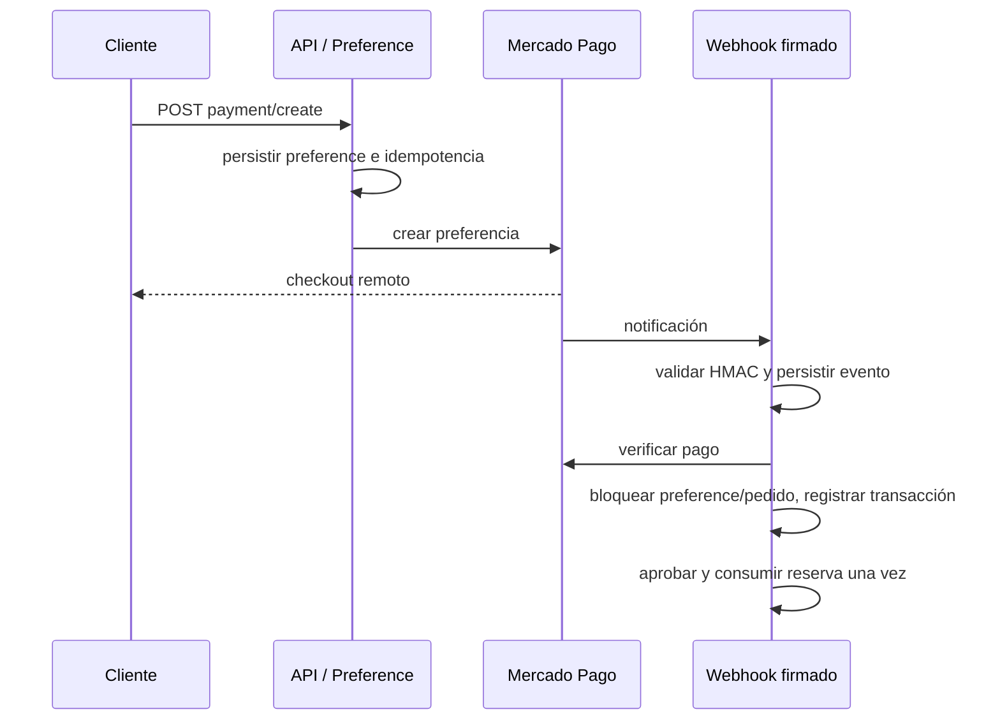
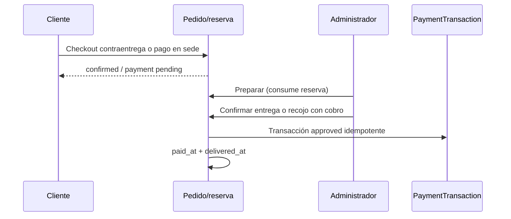
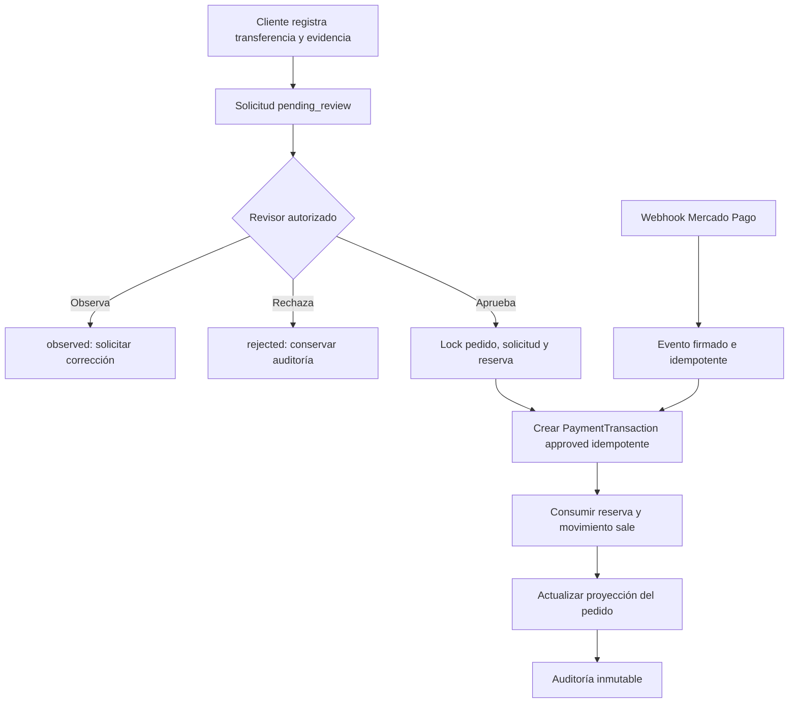

# Auditoría del flujo de pagos y Tesorería

## Resumen ejecutivo

Yape, Plin y banco siguen siendo `orders.payment_method=transferencia` y se distinguen por canal (`yape`, `plin`, `bank_transfer`). La Fase 2B1 está cerrada: el cliente autenticado puede consultar opciones y QR privados, registrar una presentación idempotente y recuperarla tras recargar. El importe esperado proviene exclusivamente de `orders.total`; la operación se conserva como texto y no hay pagos parciales ni cuotas.

LubriStore tiene cuatro valores comerciales de método de pago: `card`, `transferencia`, `contra_entrega` y `pago_en_sede`. Mercado Pago tiene una arquitectura persistente para preferencias, transacciones y webhooks; contraentrega/pago en sede generan una `PaymentTransaction` al confirmarse el cobro. La transferencia bancaria se aprueba desde el flujo operativo de pedidos, pero su aprobación **no crea una `PaymentTransaction`, no guarda evidencia, referencia, importe declarado, aprobador ni historial financiero específico**. Ese es el principal bloqueo para una conciliación confiable.

Existen roles `admin`, `customer` y `treasury`. `active_user` bloquea usuarios inactivos; `is_treasury` existe, pero las cuentas receptoras siguen siendo una configuración exclusiva de `admin`. Aún no existe una bandeja operativa para que Treasury observe, rechace o apruebe presentaciones.

Esta auditoría es de lectura: se inspeccionaron rutas, código, migraciones, modelos y pruebas. No se invocaron endpoints mutantes, pagos, webhooks, migraciones, seeders ni base de datos comercial.

## Situación actual y métodos admitidos

`app/Http/Controllers/Api/V1/OrderController.php::store` valida exactamente:

| Valor persistido en `orders.payment_method` | Modalidad compatible | Fuente pública |
|---|---|---|
| `card` | delivery o pickup | Tarjeta; gateway activo `mock` o Mercado Pago |
| `transferencia` | delivery o pickup | Transferencia bancaria / Yape / Plin |
| `contra_entrega` | solo delivery | Cobro al confirmar entrega |
| `pago_en_sede` | solo pickup | Cobro al registrar recojo |

Yape y Plin **no son métodos independientes**. `PaymentSetting` guarda teléfonos en `transfer_yape_phone` y `transfer_plin_phone`; `PaymentSettingService::getPublicMethods()` los expone como billeteras dentro del único método `transferencia`. No existe `payment_method=yape` ni `payment_method=plin`.

El gateway `mock` es una configuración de tarjeta para pruebas, no un valor de `payment_method`. El webhook mock heredado solo se permite en entorno `testing` cuando se configura expresamente; el tráfico de Mercado Pago usa la ruta firmada.

## Inventario técnico

### `orders`

Modelo: `app/Models/Order.php`. Tabla creada en `2026_01_18_203611_create_orders_table.php` y ampliada por migraciones posteriores.

| Grupo | Campos relevantes |
|---|---|
| Comercial | `status`, `subtotal`, `discount_total`, `shipping_amount`, `total`, `payment_method`, `payment_status` |
| Pago | `payment_id`, `current_payment_preference_id`, `payment_data`, `paid_at` |
| Reserva | `reserved_until`; relación `reservations` |
| Entrega | `delivery_type`, `pickup_branch_id` y snapshots de recojo/envío, `tracking_status`, `fulfillment_status`, `delivered_at` |
| Auditoría operativa | `prepared_by`, `ready_by`, `delivered_by`, timestamps Eloquent |

`payment_status` nació como enum: `pending`, `approved`, `rejected`, `refunded`. El servicio también trata `in_process` como `pending`; Mercado Pago conserva su estado remoto en `PaymentTransaction.provider_status`, no en este campo. `status` comercial admite `pending`, `confirmed`, `shipped`, `delivered`, `canceled`, `rejected` en `OrderStateService`.

Faltan en `orders` los datos suficientes para comprobar una transferencia: operación declarada, fecha declarada, cuenta receptora, evidencia, aprobador/rechazador y motivo de decisión. `payment_data` es JSON, pero no hay flujo que los solicite ni contrato que lo normalice.

### `payment_transactions`

Modelo: `app/Models/PaymentTransaction.php`; migraciones `2026_08_01_070260_create_payment_transactions_table.php` y `2026_09_04_070510_add_gateway_fields_to_payment_transactions_table.php`.

| Campo/grupo | Uso actual |
|---|---|
| Identidad | `order_id` con `restrictOnDelete`, `gateway`, `payment_method`, `transaction_type` (`payment`/`refund`) |
| Resultado | `status` (`pending`, `approved`, `failed`, `canceled`), `amount`, `currency` |
| Idempotencia | `idempotency_key` UNIQUE, `approved_scope_key` UNIQUE nullable, UNIQUE `(gateway, provider_payment_id)` |
| Proveedor | `external_reference`, `provider_payment_id`, `payment_preference_id`, `provider_status`, `provider_status_detail`, `verified_at` |
| Cobro manual | `manual_reference`, `collection_method`, `collected_by`, `collected_at`, `confirmed_by`, `confirmed_at` |
| Fallo | `failed_at`, `failure_reason`, `metadata` |

Índices adicionales: `(order_id,status)` y `(payment_method,transaction_type,status)`. El modelo bloquea `update` y `delete`, por lo que una transacción confirmada es inmutable. La tabla puede registrar referencia manual y aprobador para contraentrega/pago en sede, pero **la aprobación de transferencia vigente no la usa**. Tampoco contiene enlace de comprobante o evidencia.

### `payment_preferences`

Modelo: `PaymentPreference`; migración `2026_09_04_070500_create_payment_preferences_table.php`.

Estados: `creating`, `active`, `superseded`, `failed`, `orphaned`. Tiene `order_id` restrictivo, `provider_preference_id` UNIQUE, `external_reference` UNIQUE, `idempotency_key` UNIQUE y una columna generada `active_order_id` que fuerza una preferencia `creating`/`active` por pedido. Guarda URLs de checkout y fechas de inicio, activación, fallo o sustitución.

### `payment_webhook_events`

Modelo: `PaymentWebhookEvent`; migración `2026_09_04_070520_create_payment_webhook_events_table.php`.

Estados: `received`, `processing`, `processed`, `ignored`, `failed`. Registra gateway, identificadores remotos, hash de payload y request, `idempotency_key` UNIQUE, motivo de fallo y tiempos de recepción/proceso. Índice `(gateway,provider_payment_id)`. No persiste el payload completo, una decisión adecuada para reducir exposición; por ello no sirve como comprobante de transferencia manual.

### `payment_settings`

Modelo: `PaymentSetting`; migración `2026_08_03_070430_create_payment_settings_table.php`. Es configuración singleton por convención (`firstOrCreate`), sin índice único explícito que lo garantice. Define habilitación, títulos e instrucciones de tarjeta, transferencia/Yape/Plin, contraentrega y pago en sede. El token de Mercado Pago usa cast `encrypted` y está oculto; los datos de cuenta/billetera sí son configuración administrativa, no evidencia de un pago.

### Reservas, inventario y evidencia

`inventory_reservations` tiene una fila por `order_item_id` (UNIQUE), `idempotency_key` UNIQUE, estados `active`, `consumed`, `released`, `expired`, tiempos de expiración/consumo/liberación e índices por estado, pedido y producto-almacén. `warehouse_inventories.reserved_quantity` mantiene el saldo comprometido. `InventoryMovement` es inmutable y usa `idempotency_key` UNIQUE; ventas consumidas generan `sale`, devoluciones por cancelación `cancellation_return`.

No se localizó una tabla ni endpoint de comprobantes de transferencia. Las evidencias existentes pertenecen a entrega (`order_delivery_attempts` y almacenamiento de evidencia de delivery), no a pagos.

## Flujos actuales por método

### Creación común del pedido

`POST /api/v1/orders` exige usuario autenticado. `OrderController::store` valida método, modalidad, dirección o sede, recalcula precios desde `Product`, vuelve a cotizar delivery y toma el almacén principal activo. Crea pedido, items y reserva dentro de una transacción. El token se busca con `checkout_token` **y** `user_id` bajo `lockForUpdate`; un token perteneciente a otro usuario obtiene error de validación.

- Tarjeta y transferencia: `status=pending`, `payment_status=pending`, `tracking_status=pending`, reserva con vencimiento configurable (por defecto 30 minutos).
- Contraentrega y pago en sede: `status=confirmed`, `tracking_status=confirmed`, `payment_status` conserva su default `pending`; la reserva se crea con vencimiento de diez años como compromiso operativo hasta consumirla.
- Delivery calcula y snapshottea tarifa; pickup deja envío en cero y snapshottea sede. Los precios, tarifa y snapshots no llegan confiados desde frontend.

### Transferencia, Yape y Plin

No existe carga de comprobante/archivo en 2B1. Sí existe un paso de cliente que registra una presentación con operación, fecha declarada y cuenta receptora; Yape/Plin se presentan como canales de `transferencia` mediante cuentas receptoras y QR privado.

La única aprobación es `POST /api/v1/admin/orders/{order}/fulfillment/approve-transfer`, llamada desde `resources/js/views/admin/Orders.vue::runAction` al elegir “Aprobar transferencia”. El componente pide confirmación visual, sin payload de referencia, importe, fecha, comprobante u observación.

`OrderFulfillmentController::approveTransfer` delega en `OrderFulfillmentService::approveTransfer`:

1. abre transacción y bloquea `orders` con `lockForUpdate`;
2. exige `payment_method=transferencia`, estado de fulfillment `reserved` y pago aún no aprobado;
3. consume las reservas mediante `InventoryService::consumeOrderReservation`, que bloquea inventario y registra movimientos `sale` de forma idempotente;
4. actualiza `orders.payment_status=approved`, `paid_at`, `status=confirmed`, `tracking_status=confirmed`;
5. devuelve la presentación de fulfillment.

La repetición después de aprobado devuelve el pedido sin volver a consumir inventario. Sin embargo, no genera `PaymentTransaction`, no escribe `OrderFulfillmentHistory`, no registra usuario aprobador ni notifica. La ruta está dentro de `is_admin`: puede ejecutarla cualquier administrador activo.

```mermaid
sequenceDiagram
  participant C as Cliente
  participant O as Pedido/reserva
  participant A as Administrador
  participant F as Fulfillment
  C->>O: Checkout transferencia
  O-->>C: pending / reserva activa
  A->>F: approve-transfer
  F->>F: lockForUpdate pedido
  F->>O: consumir reserva y movimientos sale
  F->>O: payment_status=approved; paid_at; confirmed
  Note over F,O: No PaymentTransaction ni comprobante
```

### Mercado Pago y tarjeta

`POST /api/v1/payment/create` requiere Sanctum y comprueba propiedad del pedido. Solo admite pedidos `card` pagables, no vencidos, no terminales y no aprobados. `PaymentPreferenceService::createFor` persiste primero una preferencia con claves únicas, bloquea el pedido, realiza la llamada remota después de persistir intención y evita reintentos ciegos: un resultado incierto queda `orphaned` para conciliación.

`GET /api/v1/payment/return` requiere propietario, pero es solo informativo: no llama al proveedor, no cambia inventario ni estado. `GET /api/v1/payment/verify/{paymentId}` también exige propietario, pedido y transacción local existente para el gateway/preferencia; procesa una verificación remota bajo las mismas reglas del procesador.

`POST /api/v1/payment/webhook` es público y no usa sesión Sanctum. `PaymentWebhookSignatureService::validate` comprueba la firma HMAC de Mercado Pago con ventana de tolerancia. Después persiste/bloquea `PaymentWebhookEvent` por clave idempotente, consulta al proveedor y busca preferencia por gateway, preferencia externa y referencia externa. `PaymentProcessingService::process` bloquea preferencia y pedido, valida referencia, importe y moneda para gateway real, evita asociar un pago remoto a otro pedido, crea una transacción y aplica estado.

Cuando se aprueba, se registra una `PaymentTransaction` aprobada, se confirma el pedido y se consume una sola vez la reserva. Webhooks repetidos retornan `ok` sin reprocesar; también hay límites por UNIQUE de evento, pago remoto y ámbito aprobado. `rejected` mantiene el pedido pendiente y la reserva activa para reintentar mientras no venza. `refunded`, `charged_back` y `cancelled` generan advertencia y requieren revisión manual; no cancelan ni reponen inventario automáticamente en `PaymentProcessingService`.



### Contraentrega y pago al recoger

Ambos se crean confirmados operativamente pero pendientes de pago. Para poder iniciar preparación, `OrderFulfillmentService::startPreparation` exceptúa estos métodos de la exigencia de pago aprobado y consume la reserva. En pickup, `markAsPickedUp` exige `money_received=true` y `collection_method` (`cash`, `card_terminal`, `bank_transfer` u `other`); invoca `OrderPaymentService::confirmCashOnDeliveryCollection` y luego establece `picked_up_at`, `delivered_at`, `status=delivered` y fulfillment entregado.

Para delivery del flujo vigente, la confirmación logística termina en `OrderDeliveryService` y usa el mismo `OrderPaymentService`; las pruebas muestran que crea una sola transacción, marca pago aprobado y no genera otro movimiento de inventario. El servicio bloquea el pedido y usa claves `cod-collection-order-{id}` y `cod-approved-order-{id}`; conserva cobrador, fecha, confirmador, método y referencia manual opcional.



## Matriz de transiciones demostradas

| Evento | `payment_status` / pedido | Reserva e inventario | Transacción / historial | Acción posterior |
|---|---|---|---|---|
| Crear tarjeta/transferencia | pending / pending | activa, vence | no transacción | pagar o aprobar transferencia |
| Crear COD/pago en sede | pending / confirmed | activa, compromiso largo | no transacción | preparar sin pago aprobado |
| Aprobar transferencia | approved / confirmed | consume; movimiento `sale` | **sin PaymentTransaction**; sin historial financiero | preparar |
| Webhook tarjeta aprobado | approved / confirmed | consume; `sale` idempotente | transacción aprobada + evento procesado | preparar |
| Webhook repetido | sin cambio | sin cambio adicional | evento/UNIQUE evita duplicado | ninguna |
| Webhook rechazado | rejected / pending | reserva sigue activa | intento fallido cuando se procesa | reintentar antes del vencimiento |
| Expirar reserva de tarjeta/transferencia | pedido se cancela cuando se detecta en flujo de expiración | activa → expired; libera reservado; sin `sale` | sin pago financiero nuevo | nuevo checkout |
| Cancelar antes de consumo | canceled | activa → released; físico igual | historial fulfillment; sin movimiento de retorno | terminal |
| Cancelar después de consumo | canceled | consumida; físico repuesto; `cancellation_return` | historial fulfillment | terminal; no reembolso automático |
| Entregar COD/pago en sede | approved / delivered | ya consumida, físico no cambia | transacción aprobada idempotente e historial de delivery/fulfillment | terminal |
| Reembolso, contracargo o `cancelled` remoto | revisión manual; no transición automática fiable | no reposición automática | evento/procesador puede dejar advertencia | intervención financiera manual |

La columna “historial” es operativa (`OrderFulfillmentHistory`, delivery o handling) y no equivale a un libro mayor financiero. La aprobación de transferencia no crea tampoco una fila de este historial desde `approveTransfer`.

## Aprobación manual, responsabilidades y riesgos

`resources/js/views/admin/Orders.vue` combina la vista de pedido, el botón “Aprobar transferencia”, acciones de fulfillment, el panel de picking/packing y delivery. La ruta administrativa está protegida solo por `is_admin`; no hay policy, FormRequest específico, rol de tesorería ni separación entre quien aprueba y quien prepara.

| Hallazgo | Clasificación | Evidencia / impacto |
|---|---|---|
| Preferencias, webhooks y pagos remotos persistentes e idempotentes | Correcto | `PaymentPreferenceService`, `PaymentWebhookEvent`, índices UNIQUE y `PaymentProcessingService` |
| Cobro COD/pago en sede con transacción inmutable e idempotencia | Correcto | `OrderPaymentService::confirmCashOnDeliveryCollection` |
| Preparación bloqueada para tarjeta/transferencia sin aprobación | Correcto | `OrderFulfillmentService::startPreparation` |
| COD/pago en sede puede prepararse antes del cobro | Aceptable para etapa inicial | Política explícita; riesgo comercial normal de contraentrega |
| Yape/Plin agrupados bajo transferencia | Aceptable para etapa inicial | Configuración clara, pero sin conciliación independiente |
| Aprobar transferencia no registra transacción ni aprobador | Bloqueo para producción | No existe evidencia, importe, cuenta, usuario ni auditoría financiera verificable |
| Cualquier admin puede aprobar y preparar | Riesgo alto | `is_admin` binario; no hay segregación de funciones |
| Sin rechazo/observación/reversión de transferencia | Riesgo alto | No hay rutas, servicio ni modelo para esas decisiones |
| Sin comprobante de archivo y sin revisión de Tesorería | Riesgo alto | 2B1 registra operación, fingerprint e historial, pero aún no hay bandeja de observación/rechazo/aprobación |
| Reembolso/contracargo no automatiza stock | Correcto como medida de seguridad, pero incompleto | Requiere política y bandeja manual |
| `orders.payment_data` JSON como posible contenedor informal | Riesgo medio | No tiene esquema, evidencia ni auditoría |

## Capacidades ausentes confirmadas

No se localizó operación para rechazar transferencia, marcar comprobante inválido, solicitar corrección, registrar pago parcial o excedente, revertir aprobación, iniciar reembolso, adjuntar observaciones financieras, almacenar comprobante, detectar duplicados por número de operación o conciliar contra cuenta receptora. Tampoco hay endpoint administrativo de listado de transacciones/eventos de pago; solo existe la configuración `GET/PUT /api/v1/admin/payment-settings`.

## Propuesta: módulo Tesorería

Ruta propuesta: `/admin/treasury/payments`. No debe reemplazar operaciones de fulfillment ni mutar directamente `orders` desde Vue. Debe usar un servicio financiero transaccional que, al aprobar, cree la transacción y aplique la proyección de pedido/reserva en una única unidad atómica.

### Bandejas, filtros y detalle

| Bandeja | Origen | Filtros mínimos | Acciones autorizadas |
|---|---|---|---|
| Pendientes de validación | transferencias con comprobante o declaración | fecha, método, importe, cuenta, pedido, cliente anonimizado | aprobar, rechazar, observar |
| Aprobados | transacciones approved | periodo, método, aprobador, referencia | ver auditoría; no editar |
| Rechazados / observados | decisión financiera persistida | motivo, usuario, periodo | solicitar corrección o reabrir bajo regla explícita |
| Mercado Pago | `PaymentTransaction` + `PaymentWebhookEvent` | provider status, preference, pago remoto, periodo | ver estado; derivar a revisión manual |
| COD / pago en sede | transacciones de cobro manual | recojo/delivery, collector, método de cobro | ver confirmación y referencia |
| Reembolsos / revisión manual | transacciones/eventos de excepción | refunded, charged_back, cancelled, motivo | iniciar proceso controlado, sin reposición automática |

Columnas: pedido, método, estado financiero interno, estado proveedor cuando exista, importe y moneda, referencia, fecha declarada/confirmada, usuario que decidió, evidencia disponible y enlace administrativo seguro. KPIs: pendientes, importe pendiente, aprobados del periodo, rechazados, observados, excepciones remotas y cobros COD pendientes; ninguno debe sumar pedidos duplicados ni datos no aprobados.

El detalle debe separar snapshot del pedido, datos declarados, cuenta receptora snapshot, archivos de evidencia con acceso autorizado, decisión, transacciones inmutables y línea de auditoría. No debe mostrar tokens, payload remoto íntegro ni datos personales ajenos al caso.

### Modelo de permisos recomendado

Actualmente no conviene inventar un rol nuevo en frontend: `users.role` solo tiene `admin`/`customer` y `is_admin` protege todo el bloque. Alternativas ordenadas:

1. **Fase inicial controlada:** capacidad booleana explícita y temporal, por ejemplo `can_manage_treasury`, aplicada por middleware/policy a rutas de Tesorería; requiere migración y auditoría de cambios.
2. **Opción preferida escalable:** tablas de roles/permisos o una matriz de capacidades (`payments.view`, `payments.review`, `payments.approve`, `payments.refund`) con middleware/policies. Permite separar consulta, revisión y aprobación.
3. **Ampliar enum de roles:** posible, pero menos flexible y requiere migración, UI de usuarios, middleware y pruebas de compatibilidad.

Debe impedirse que una persona apruebe su propio registro de cobro cuando el proceso comercial lo requiera; al menos deben quedar `submitted_by`, `reviewed_by`, `approved_by` y marcas temporales distintas.

### Datos y garantías que requeriría una fase futura

Se recomienda una entidad de solicitud/evidencia financiera separada de la transacción inmutable, por ejemplo `payment_reviews` o `payment_submissions`: `order_id`, método, estado (`pending_review`, `observed`, `approved`, `rejected`, `manual_review`), importe declarado, fecha declarada, referencia normalizada, cuenta receptora snapshot, evidencia, notas, submitter/reviewer/decision timestamps y clave idempotente. Se necesitarían índices por estado/fecha/pedido/referencia y una UNIQUE contextual para prevenir la misma referencia activa en la misma cuenta y moneda. No debe imponerse una UNIQUE global sin reglas de negocio para referencias vacías o proveedores distintos.

La aprobación debe bloquear pedido, solicitud y reserva; validar importe/cuenta/estado; crear una `PaymentTransaction` con `approved_scope_key`; marcar solicitud aprobada; consumir una reserva activa una vez; y actualizar `orders.payment_status`/`paid_at`. Rechazar u observar no debe consumir stock. Cualquier reversión posterior requiere una transacción de ajuste/reembolso y política explícita de inventario, no mutar la transacción original.



## Plan de implementación por fases

1. **Fundación financiera:** migraciones para solicitudes/evidencias/auditoría, permisos y claves únicas; Resources que oculten datos sensibles; backfill nulo y compatible con pedidos históricos.
2. **Transferencia:** submit cliente/admin, archivos privados, validación de referencia/importes, aprobar/rechazar/observar transaccionalmente y pruebas de concurrencia.
3. **Bandeja administrativa:** filtros, KPIs, detalle, auditoría, paginación y políticas. Retirar el botón de aprobación desde el modal operativo o convertirlo en enlace a Tesorería.
4. **Conciliación y excepciones:** Mercado Pago, COD/pago en sede, duplicados, conciliación manual y workflow de refund/chargeback sin reposición automática implícita.
5. **Certificación:** pruebas MySQL de locking/UNIQUE, permisos, archivos, privacidad, idempotencia, migración de históricos y smoke de navegador.

Cambios requeridos: migraciones y modelos nuevos; servicio de revisión/conciliación; controladores, Requests y policies/middleware; frontend de Tesorería; integración en Orders.vue solo como enlace; pruebas feature/concurrencia y actualización documental. No se deben cambiar snapshots, reservas, movimientos, picking/packing, pickup, delivery, reportes ni Mercado Pago ya persistente sin pruebas de regresión.

## Evidencia y verificaciones

| Tipo | Fuente inspeccionada |
|---|---|
| Rutas | `routes/api.php`; `php artisan route:list --path=api/v1` |
| Checkout | `app/Http/Controllers/Api/V1/OrderController.php::store` |
| Pago remoto | `PaymentController`, `PaymentPreferenceService`, `PaymentProcessingService`, `PaymentWebhookSignatureService`, gateways |
| Pago manual y fulfillment | `OrderPaymentService`, `OrderFulfillmentService`, `OrderFulfillmentController`, `resources/js/views/admin/Orders.vue` |
| Inventario/reservas | `InventoryService`, `InventoryReservation`, `InventoryMovement` |
| Esquema | migraciones de orders, reservas, settings, preferences, transactions y webhook events |
| Permisos | `routes/api.php`, `User` y middleware `is_admin` |
| Pruebas leídas | `PaymentWebhookAdversarialTest`, `PaymentPersistenceModelTest`, `PaymentConfigurationAndSimulationTest`, `InventoryReservationPhaseThreeTest`, `ReservationExpirationTest`, `OrderFulfillmentPhaseThreeBTest`, `OrderDeliveryPhaseFiveTest`, `DeliveryFleetManagementTest` |
| Estado de migraciones | `php artisan migrate:status`: las migraciones de preferencias, gateway, webhooks y FK de preferencia figuran como ejecutadas localmente |

No se ejecutaron pruebas en esta auditoría. Las afirmaciones de comportamiento se basan en el código y pruebas inspeccionados, no en un pago o webhook disparado durante este trabajo.

## Preguntas de negocio pendientes

- ¿Quién puede registrar una transferencia y quién puede aprobarla; se exige doble control?
- ¿Qué evidencia es obligatoria por importe/método y cuánto tiempo se conserva?
- ¿Qué cuenta receptora, moneda y tolerancia de importe se admiten por canal?
- ¿Cómo se trata pago parcial, excedente, referencia duplicada y operación sin referencia?
- ¿Yape/Plin requieren clasificación separada para conciliación, aunque sigan bajo transferencia comercial?
- ¿Qué política financiera e inventario corresponde a reembolso, contracargo, devolución y pedido ya entregado?
- ¿Cuál es la fuente de verdad de conciliación bancaria y cómo se integrará sin exponer credenciales?

## Conclusión

El sistema tiene una base sólida para tarjeta/Mercado Pago y para cobros COD/pago en sede gracias a transacciones idempotentes. Transferencias ya cuentan con presentación, operación declarada, cuenta receptora snapshot, fingerprint, historial y prevención de duplicados de 2B1; aún faltan revisión, decisión financiera y `PaymentTransaction` de 2B2/2B3. Hasta entonces, el botón “Aprobar transferencia” dentro de Operaciones sigue siendo un flujo legacy y un bloqueo de trazabilidad financiera completa, aunque su consumo de inventario sea transaccional e idempotente.

## Estado de Tesorería: Infraestructura, 2A y 2B1

La infraestructura y la Fase 2A están implementadas: rol `treasury`; tablas `payment_submissions`, `payment_submission_histories` y `payment_receiving_accounts`; migraciones `070540`, `070550` y `070560` ejecutadas; cuentas administrativas cifradas para Yape, Plin y banco; un default activo por canal; y QR estático en almacenamiento privado. Los Resources administrativos enmascaran datos sensibles. La configuración limita extensión de reserva y tolerancia futura; las restricciones `UNIQUE` respaldan invariantes, pero la concurrencia real de MySQL continúa pendiente de certificación específica.

### Fase 2B1-A: opciones y QR del cliente — cerrada

`GET /api/v1/orders/{order}/payment-options` y `GET /api/v1/orders/{order}/payment-options/{account}/qr` exigen `auth:sanctum`, `active_user` y propiedad del pedido. Para crear una nueva presentación validan transferencia pendiente, reserva activa/vigente y pedido no cancelado, entregado o recogido. Solo retornan cuentas PEN activas, principales y operativas. Yape/Plin entregan QR privado con `nosniff`; los datos bancarios completos se limitan al propietario autenticado elegible. Las respuestas usan `Cache-Control: no-store, private` y `Pragma: no-cache`; son de lectura y no mutan pedido, reserva ni inventario.

### Fase 2B1-B: presentación idempotente — cerrada

`POST /api/v1/orders/{order}/payment-submission` exige `Idempotency-Key`. Dentro de una transacción con `lockForUpdate` crea `PaymentSubmission` y su historial append-only. El importe deriva de `orders.total`, la moneda es PEN y los canales válidos son Yape, Plin y banco. La operación se normaliza sin perder su naturaleza textual; Yape/Plin requieren últimos cuatro dígitos y banco requiere banco de origen. Fingerprint, índices UNIQUE y conflictos 409 controlados reducen duplicados. La extensión es `max(vencimiento actual, ahora + reservation_extension_minutes)` y sincroniza `orders.reserved_until` con `inventory_reservations.expires_at`. El pago sigue `pending`, `orders.paid_at` sigue `null`, no se crea `PaymentTransaction` y no se consume ni libera inventario. La tolerancia futura predeterminada es 10 minutos, configurable y acotada.

### Fase 2B1-C: recuperación e interfaz cliente — cerrada con smoke manual

`GET /api/v1/orders/{order}/payment-submission` recupera una presentación propia histórica incluso si después venció la reserva o se desactivó la cuenta. Su ausencia devuelve `404` con `code=payment_submission_not_found`, también sin caché. `CustomerTransferPaymentPanel` en `OrderTracking.vue` recupera primero la presentación; solo ese 404 contractual permite consultar opciones. El QR se obtiene como blob y revoca su ObjectURL al cambiar canal/pedido o desmontar. La clave de idempotencia viaja únicamente en header, la operación se muestra enmascarada y el estado expuesto es “Pendiente de validación por Tesorería”. El backend conserva la autoridad final de elegibilidad. Tracking ahora incluye `reserved_until` ISO 8601 o `null`.

Smoke manual certificado sobre pedido #13: S/ 113.74 PEN mediante Yape; presentación creada y recuperada como `pending_review`; operación mostrada solo como `•••••4567`; `submitted_at` 2026-09-23T19:02:54-05:00; vencimiento extendido a 2026-09-23T21:02:54-05:00 (equivalente tracking UTC `2026-09-24T02:02:54+00:00`). `order.reserved_until` e `inventory_reservations.expires_at` coincidieron, el pedido permaneció `pending/reserved`, el pago `pending`, la reserva `active` y el timeline mantuvo “Pago confirmado” pendiente. El QR usado fue una imagen de prueba y debe reemplazarse por uno comercial real antes de producción.

### Siguiente fase: 2B2 — pendiente

2B2 debe limitarse a una bandeja exclusiva para `treasury`: listado, detalle seguro, filtros, historial, revisión si el esquema actual lo permite, observación y rechazo con motivo obligatorio, concurrencia/idempotencia y estado visible al cliente. No debe aprobar financieramente, crear `PaymentTransaction`, consumir/liberar inventario, modificar `payment_status`/`paid_at`, retirar el botón legacy ni implementar devoluciones.

## Cierre certificado: Fase 2B2

- **2B2-A:** bandeja backend exclusiva de Tesorería con lista, detalle, historial append-only, Resources privados y decisiones `observed`/`rejected` transaccionales; sin efectos financieros ni de inventario.
- **2B2-A2:** corrección únicamente desde `observed`, sobre la misma presentación, hacia `pending_review`; snapshot y fingerprint reconstruidos en servidor, historial `corrected`, idempotencia, extensión sincronizada de reservas activas y rollbacks inducidos. La concurrencia física de MySQL 8 sigue pendiente.
- **2B2-B1:** `/treasury/payments`, guard `requiresTreasury`, filtros, paginación, detalle, historial, observar/rechazar, tabla desktop, tarjetas móviles, modal accesible y rol Treasury administrable desde Usuarios.
- **2B2-B2:** formulario de corrección solo con reserva vigente; QR privado por blob, `Idempotency-Key` solo en memoria/header y manejo de 200/409/422/red. `pending_review` y `rejected` no muestran formulario.

### Reserva vencida

`payment-options` responde `422` con `code=reservation_expired`. No reactiva stock ni induce otro pago: el cliente ve “Revisión manual requerida” y WhatsApp únicamente si `VITE_WHATSAPP_PHONE` está configurado. Tesorería identifica “Reserva vencida”; observar queda oculto y rechazar permanece si el backend lo permite. Smoke manual del pedido #14: observación, motivo y vencimiento extendido visibles; tras vencer, revisión manual, historial `submitted → observed` y modal corregido.

## Diseño auditado inicial: Fase 2B3 — histórico

Este diagnóstico corresponde al estado previo a la implementación certificada que se documenta al final del archivo. `payment_submissions.order_id` es UNIQUE. La infraestructura 2B3-A añadió a `payment_transactions` el vínculo nullable `payment_submission_id`, FK restrictiva `pt_submission_fk` y UNIQUE `pt_submission_unique`. Se reutiliza `payment_transactions.idempotency_key` para la creación idempotente de la transacción y `approved_scope_key` para el ámbito canónico aprobado por pedido. Las transacciones legacy siguen permitidas sin presentación.

Flujos paralelos encontrados: el legado `Orders.vue → POST /admin/orders/{order}/fulfillment/approve-transfer → OrderFulfillmentService::approveTransfer` consume reserva y aprueba pedido sin crear `PaymentTransaction` ni aprobar `PaymentSubmission`; tarjeta/Mercado Pago usa `PaymentController` y `OrderPaymentService::recordCardAttempt`; COD/pago en sede usa `confirmCashOnDeliveryCollection`; expiración libera reservas. El legado debe bloquearse o delegar al servicio 2B3 antes de habilitar aprobación Treasury.

`InventoryService::consumeOrderReservation()` bloquea `Order`, reservas por id y luego cada inventario; exige una reserva por item, consume solo `active`, omite `consumed`, rechaza `released`/`expired`, verifica cantidades, descuenta físico/reservado, crea movimiento idempotente por item y sincroniza `products.stock`, dentro de transacción. 2B3 debe coordinarlo con los bloqueos financieros.

Propuesta vigente: bloquear en orden `PaymentSubmission → Order → PaymentTransaction → InventoryReservation → WarehouseInventory → Product`; revalidar `pending_review`, PEN, total, reserva activa y vigente; crear una única transacción ligada a la presentación; aprobar presentación e historial; proyectar pago y consumir reservas atómicamente. Reserva vencida/liberada/sin activa no debe aprobarse: `manual_resolution_required`, reasignación, devolución o aplicación a nuevo pedido no existen y requieren decisión comercial/diseño. Reserva consumida o pedido pagado debe ser reintento idempotente o conflicto.

Responsabilidades: Tesorería valida dinero; sistema transaccional crea transacción/consume reserva; soporte resuelve pagos vencidos y devoluciones; almacén prepara después de pago aprobado; cliente solo consulta. **Clasificación:** reserva vigente = B, requiere migración; reserva vencida = C, requiere decisión de negocio.

## Cierre vigente: Fase 2B3

Esta sección sustituye las menciones históricas de este documento que describían 2B3 como pendiente.

### 2B3-A: vínculo financiero persistente

La migración `2026_09_25_070570_add_submission_approval_link_to_payment_transactions_table.php` está aplicada controladamente en la base local `lubricantes`. Añade `payment_transactions.payment_submission_id` nullable, compatible con transacciones legacy; su FK `pt_submission_fk` referencia `payment_submissions(id)` con `ON DELETE RESTRICT` y `pt_submission_unique` garantiza una sola transacción por presentación no nula. `PaymentSubmission::paymentTransaction()` y `PaymentTransaction::paymentSubmission()` expresan el vínculo Eloquent sin carga automática. `idempotency_key` conserva la idempotencia de creación de la transacción y `approved_scope_key` usa la clave canónica por pedido. Ambas claves siguen ocultas en serialización.

### 2B3-B: aprobación financiera atómica

`PATCH /api/v1/treasury/payment-submissions/{submission}/approve` está protegido por autenticación, usuario activo y rol Treasury; el Request exige body estrictamente vacío. El servidor construye las claves deterministas, acepta solo `pending_review` con reserva activa/vigente y realiza en una transacción: `pending_review → approved`, `PaymentTransaction` ligada, historial `approved`, `Order.payment_status=approved`, `paid_at`, consumo de reservas, descuento físico y reservado, `InventoryMovement` `sale` y sincronización de `Product.stock`. Picking y packing no avanzan automáticamente. Un reintento coherente no duplica efectos; estados financieros parciales son conflicto y una reserva vencida devuelve `manual_resolution_required`. El endpoint legacy sigue disponible para pedidos históricos sin `PaymentSubmission`, pero responde `409 treasury_approval_required` ante cualquier presentación.

La certificación cubrió rollbacks atómicos en SQLite y MySQL 8.4.3 aislado, incluidas 10 carreras aprobación/aprobación, 10 aprobación/expiración y 10 aprobación/cancelación: sin deadlocks ni estados parciales. La única omisión específica en MySQL fue el trigger SQLite `RAISE(ABORT)`; su rollback se ejecuta en SQLite y la garantía equivalente quedó cubierta por las pruebas transaccionales y de concurrencia MySQL.

### 2B3-C: interfaces y smoke local

La bandeja Treasury muestra botón/modal de aprobación solo para `pending_review` con reserva activa y envía `{}`. Gestiona conflictos 409 y una presentación aprobada queda sin acciones posteriores. El Resource de cliente muestra “Pago validado por Tesorería.”, `validated_at` y operación enmascarada; tracking no presenta QR ni formularios una vez recuperada la presentación.

Smoke local documentado: pedido #15, presentación #4, Yape por PEN 131.86, transición `pending_review → approved`, una transacción vinculada, una reserva `consumed`, un movimiento `sale`, stock físico/reservado actualizado una vez, historial `submitted → approved` y sin inicio de picking/packing. La operación no se documenta: su máscara segura de cinco caracteres es `•••11`. No se ejecutó manualmente un reintento; los invariantes persistidos fueron certificados como coherentes.

### Administración de pedidos y estado restante

El listado y detalle administrativo de pedidos exponen solo `has_payment_submission` y `payment_submission_status`, obtenidos mediante `withExists` y carga eager limitada (`id`, `order_id`, `status`), sin N+1 ni serializar la presentación. Para transferencias con presentación, `Orders.vue` retira visualmente “Aprobar transferencia” y muestra una etiqueta de Tesorería; no enlaza a una ruta Treasury porque el rol admin no puede acceder a ella. Los pedidos legacy sin presentación conservan su botón y flujo existente.

Siguen pendientes: resolución comercial de pagos con reserva vencida, reasignaciones, devoluciones, notificaciones, eventual saneamiento histórico de `approved_scope_key`, despliegue/producción y monitoreo financiero. Ninguno de estos puntos se considera implementado.

### 2B4-A: infraestructura persistente pendiente de aplicar

La Fase 2B4-A incorpora únicamente migraciones y modelos pendientes, sin rutas, servicios, interfaz ni acciones que reasignen stock, reabran pedidos o registren devoluciones. Define `payment_resolution_cases`, su historial append-only y `payment_refunds`; las referencias externas de devolución se cifran y permanecen ocultas. El caso inicia con tipo nullable y estado `open`, porque Tesorería decidirá posteriormente entre reasignación o devolución mediante una operación futura explícita.

Las reservas pasan a versionarse por `order_item_id` y `reservation_sequence`: las históricas conservan secuencia `1` y nunca se reactivan; una futura reasignación deberá crear una reserva nueva, vinculada al caso, calculando la siguiente secuencia bajo bloqueo. La primera versión queda restringida al almacén original del `OrderItem`, la devolución será íntegra y `refund_failed` será un estado interno: el cliente seguirá viendo devolución en proceso.

También queda preparado `refund_pending` en el estado de pago del pedido, y `manual_resolution_required`, `refund_pending` y `refunded` en la presentación. Las migraciones siguen **pendientes** y no existe todavía una transición funcional hacia esos estados. La aprobación normal continúa rechazando reservas vencidas; no se agregó devolución automática ni integración con Yape, Plin o banco.

#### Certificación adversarial de esquema (SQLite y MySQL 8.4.3)

La infraestructura se certificó sin aplicarla en `lubricantes`. En SQLite y en una base MySQL aislada terminada en `_test`, las claves únicas verificadas son una por presentación de resolución, una por transacción recibida no nula, una devolución por caso, una por transacción de devolución no nula, y las claves de idempotencia de caso y devolución. Las FKs de presentación, transacción, caso e historial usan `RESTRICT`; los actores usan `SET NULL`. El historial no tiene borrado en cascada, es append-only en el modelo y su `safe_metadata` se reduce a la allowlist documentada. Las referencias externas de devolución se cifran y no se serializan.

El versionado conserva `reservation_sequence=1` en filas históricas, preserva la unicidad de `idempotency_key` y reemplaza únicamente la unicidad simple de `order_item_id` por `(order_item_id, reservation_sequence)`. El rollback de 070610 restaura la unicidad legacy solo si no hay secuencias mayores a uno; ante versiones posteriores se detiene antes de cambiar esquema o datos. El rollback de 070620 también se niega si persiste cualquier pedido `refund_pending`. Se corrigió la migración 070610 para crear primero el índice compuesto: MySQL necesita conservar un índice cuyo prefijo sea `order_item_id` mientras exista la FK hacia `order_items`.

Quedan explícitamente pendientes para 2B4-B las consultas legacy que asumen una sola reserva por ítem: `OrderItem::reservation()` es `hasOne` y `OrderTrackingController` consume esa relación singular. Los servicios existentes operan por `order_id` y estado, por lo que no se modificaron ni deben interpretar una versión histórica de forma arbitraria hasta que la reasignación tenga su transacción y criterios explícitos. Las comparaciones actuales de `payment_status` están orientadas a los estados operativos existentes (`pending`, `approved`, `rejected`); deberán revisarse antes de exponer `refund_pending` en filtros, Resources o automatizaciones. Ninguna de esas adaptaciones se implementó en 2B4-A.
