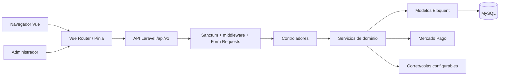
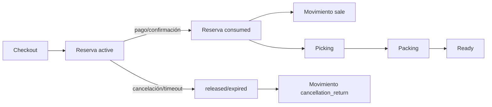
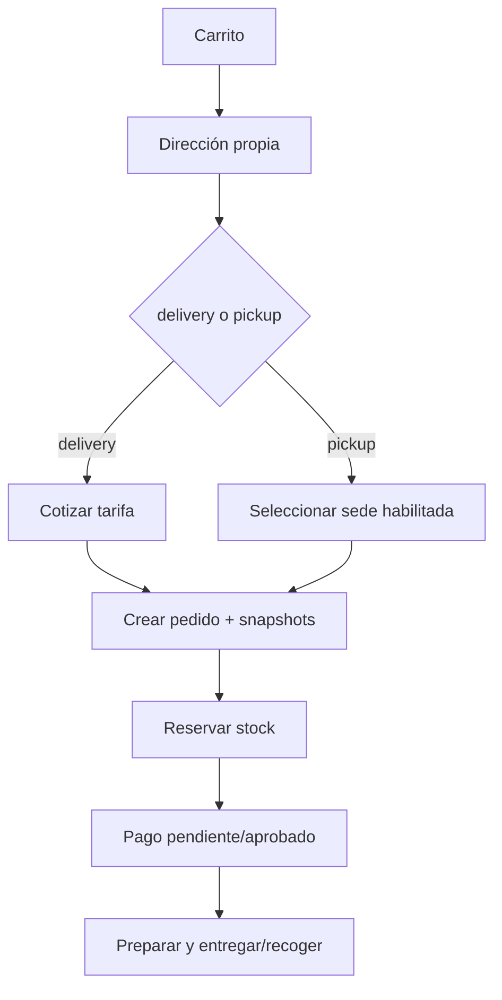
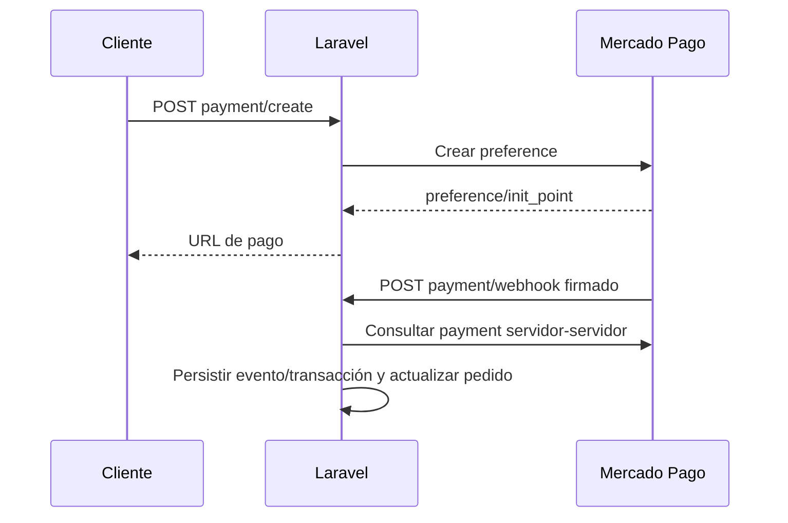
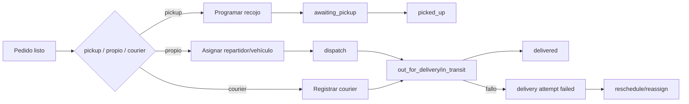
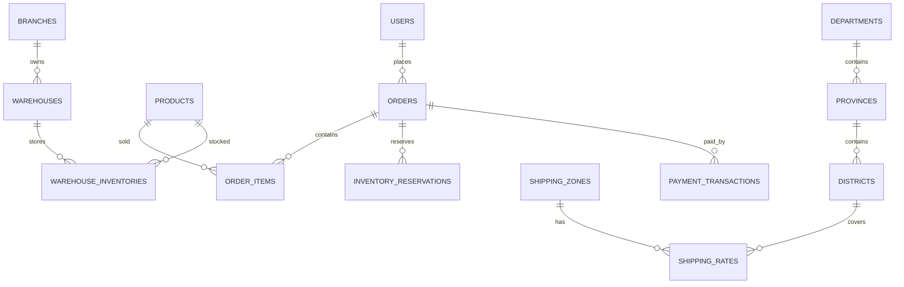

> Este documento describe el estado confirmado del repositorio en la fecha y commit indicados. El código y las migraciones tienen precedencia si posteriormente existe una diferencia.

# 1. Resumen ejecutivo

## Reportes gerenciales (interfaz administrativa)

La ruta protegida `/admin/reports/management` presenta seis pestañas: Ventas, Inventario, Movimientos, Operaciones, Tiempos de ciclo y Catálogos. Cada cambio de pestaña solicita únicamente el contrato JSON de la sección activa; no se cargan reportes ocultos. Los filtros admitidos se conservan en la query string y la exportación utiliza exactamente esos mismos parámetros mediante el endpoint `/api/v1/admin/reports/management/{section}/export`.

Movimientos admite periodo, fechas personalizadas, almacén, producto, categoría, marca, tipo y dirección. Operaciones admite modalidad, severidad, razón, etapa y vencido. Ciclos admite periodo, fechas, modalidad y las siete métricas certificadas. Catálogos admite las doce opciones (`products`, `categories`, `brands`, `warehouses`, `branches`, `drivers`, `vehicles`, `departments`, `provinces`, `districts`, `shipping_zones`, `shipping_rates`) y sus filtros específicos. No existen endpoints ligeros de opciones para departamentos, provincias, distritos o zonas; la interfaz no descarga esos catálogos masivos y deja esos selectores sin opciones hasta que se publique un contrato paginado.

El Dashboard es una vista gerencial agregada distinta de Reportes: el primero conserva su respuesta completa y pestañas visuales locales; Reportes consulta bajo demanda una sección y muestra sus filas, totales, metadatos y truncamiento. Los CSV son UTF-8 con BOM, cabeceras explícitas y neutralización contra inyección de fórmulas. Las respuestas no exponen datos personales. La suite actual validada contiene 390 pruebas exitosas; la interacción visual con navegador (smoke manual) sigue pendiente.

LubriStore es un comercio electrónico de lubricantes. Resuelve la venta de productos con catálogo, carrito, checkout, reservas de inventario, pago, preparación, despacho, entrega y recojo en sede. Los actores reales son clientes y administradores; existen entidades operativas para repartidores y vehículos.

El backend es Laravel 9.52.21 sobre PHP 8.3 y MySQL; el frontend es Vue 3 con Vite, Vue Router, Pinia, Axios y PrimeVue. Sanctum protege las sesiones API. Mercado Pago está integrado junto con un gateway mock para pruebas.

**Estado:** catálogo, carrito, territorios, sedes, inventario, reservas, fulfillment, pickup/delivery, gestión de consultas y simulación de pagos tienen implementación y pruebas automatizadas. Mercado Pago persistente dispone de endurecimiento y cuatro migraciones pendientes en la base local revisada. La activación en staging/producción exige variables, migraciones controladas, HTTPS, webhook, correo, colas y pruebas MySQL de concurrencia.

Funciones que requieren configuración: credenciales de Mercado Pago, destinatarios de correo, zonas/tarifas comerciales, sedes y almacenes productivos, repartidores/vehículos, colas y scheduler. La zona Carabayllo S/ 8.00 descrita más adelante es exclusivamente local de desarrollo.

# 2. Arquitectura real

| Capa | Implementación confirmada |
|---|---|
| Backend | Laravel 9.52.21, PHP `^8.0.2` |
| Frontend | Vue `^3.5`, Vite `^4`, Vue Router, Pinia |
| HTTP | Axios |
| UI | PrimeVue/PrimeIcons, Tailwind CSS |
| Auth | Laravel Sanctum, `auth:sanctum` |
| DB | MySQL configurado; pruebas usan SQLite en memoria cuando el test lo solicita |
| Pago | `mercadopago/dx-php ^3.16`, gateway mock |
| Colas | Laravel queue configurable por `QUEUE_CONNECTION`; jobs table migrada |
| Scheduler | `inventory:expire-reservations` cada minuto, sin solapamiento |
| Mail | Mailables/notificaciones de consultas y pedidos dependen de configuración; no se presume entrega si el mailer no está configurado |
| Archivos | Disco Laravel configurable (`FILESYSTEM_DISK`); evidencias de entrega se almacenan según servicio |

No hay frontend Vitest/Vue Test Utils localizado. La prueba frontend existente es principalmente estática sobre el código Vue.

## Mapa de comunicaciones

| Origen | Destino | Mecanismo | Auth | Datos principales | Fallos controlados |
|---|---|---|---|---|---|
| Navegador | Vue | Router/componentes | Sesión local | formularios, estado Pinia | loading/toast |
| Vue | API | Axios JSON | Bearer Sanctum cuando corresponde | productos, carrito, checkout | 401/403/422/5xx |
| API | Controladores | Routing Laravel | middleware | Request validado | ValidationException |
| Controladores | Servicios | inyección PHP | usuario autenticado | DTO/arreglos | transacciones |
| Servicios | Eloquent/MySQL | ORM/queries | conexión DB | modelos y snapshots | rollback/bloqueos |
| Laravel | Mercado Pago | SDK/Guzzle HTTPS | access token | preference/payment | failed/orphaned |
| Mercado Pago | Laravel | webhook HTTPS | firma HMAC | evento/payment id | ignored/failed |
| Laravel | correo/cola | Mail/Queue | configuración | avisos operativos | reintento/log |

# 3. Seguridad, usuarios y permisos

`AuthController` registra clientes con `role=customer`; los administradores son usuarios con `role=admin` y `User::isAdmin()`. `auth:sanctum` autentica endpoints privados y `is_admin` protege el prefijo `/admin`. No existe un sistema Spatie Permission localizado.

| Actor | Acceso real |
|---|---|
| Cliente | catálogo, carrito, direcciones propias, creación/consulta propia de pedidos, tracking y contacto |
| Administrador | todas las rutas `/api/v1/admin/*`: catálogo, inventario, territorios, sedes, tarifas, pedidos, fulfillment, delivery, pagos configurables y consultas |
| Repartidor | existe entidad/atributos de repartidor; no se localizó un portal frontend separado. Las operaciones de entrega son administrativas |

Controles confirmados: validación Laravel, propiedad del pedido en endpoints de cliente, `throttle:api`, rate limit de contacto, límites de importación territorial, errores JSON y ocultamiento de secretos/campos internos en Resources o `$hidden`. CSRF aplica al flujo web tradicional; la API usa Sanctum y tokens.

Riesgos: `APP_DEBUG` debe ser falso fuera de local; nunca exponer `APP_KEY`, access tokens, webhook secret, contraseñas ni payloads de pago. La autorización de roles es binaria (`is_admin`), por lo que ver/aprobar/eliminar no está separado en permisos finos.

# 4. Catálogo, productos y carrito

Modelos principales: `Category`, `Brand`, `Product`, `ProductImage`, `OrderItem`. La administración está en `resources/js/views/admin/Products.vue`, `Categories.vue`, `Brands.vue`; catálogo público en `Catalog.vue`, `ProductDetail.vue` y `ProductCard.vue`.

Productos tienen nombre, SKU estable/único, marca, categoría, presentación, precio, precio anterior/descuento según campos existentes, descripción, especificaciones, imágenes y `is_active`. El stock operativo se mantiene en `warehouse_inventories`; `products.stock` es un valor sincronizado temporal por `InventoryService` y no debe editarse desde Productos.

El carrito vive en `resources/js/stores/cart.js`; cantidades se normalizan con `resources/js/utils/cartQuantity.js` (enteros positivos, límites y tratamiento de valores inválidos). El frontend calcula una vista de subtotal, pero el backend recalcula precios, descuentos, envío y total. Stock cero o insuficiente se rechaza en API.

# 5. Inventario, reservas y fulfillment

Entidades: `Branch`, `Warehouse`, `WarehouseInventory`, `InventoryMovement`, `InventoryReservation`, `OrderHandlingProcess`, `OrderHandlingItem`, `OrderHandlingIncident`, `OrderHandlingHistory`, `OrderFulfillmentHistory`.

`InventoryService` es la fuente de movimientos y saldos. Usa transacciones, `lockForUpdate()` e idempotency keys/índices únicos para movimiento inicial, venta por order item, devoluciones y correcciones. Los movimientos son inmutables.

| Evento | Efecto |
|---|---|
| Checkout aceptado | reserva unidades del almacén vendible y registra expiración |
| Pago aprobado/fulfillment | consume reserva y registra movimiento `sale` |
| Cancelación/rechazo/expiración | libera reserva; la devolución registra `cancellation_return` cuando corresponde |
| Ajuste/corrección/traslado | solo desde Inventario y dentro de transacción |
| Picking/packing | valida cantidades y registra trazabilidad; no debe duplicar consumo |

Estados de reserva: `active`, `consumed`, `released`, `expired`. Fulfillment de `Order`: `reserved`, `preparing`, `ready`, `delivered`, `canceled`. Picking/packing usan procesos `pending`, `in_progress`, `completed` e incidentes `open`, `resolved`, `canceled`.

La liberación de una reserva activa solo decrementa `reserved_quantity` y actualiza `InventoryReservation` (`released`/`expired`); no crea `InventoryMovement`. El consumo cambia el saldo físico, marca la reserva `consumed` y crea un movimiento `sale`. La cancelación antes del consumo libera la reserva. La cancelación después del consumo llama `returnCancellation()` por `OrderItem`, crea un movimiento `cancellation_return` idempotente y repone inventario. La expiración libera reservas y actualiza estados, sin `cancellation_return`.

# 6. Checkout, pedidos y entrega

Rutas Vue: `Cart.vue`, `Checkout.vue`, `OrderSuccess.vue`, `PaymentReturn.vue`, `Orders.vue`, `OrderTracking.vue`. API principal: `POST /api/v1/orders`, `GET /api/v1/orders`, `GET /api/v1/orders/{order}`, `GET /api/v1/orders/{id}/tracking`, `POST /api/v1/checkout/shipping-quote`, `GET /api/v1/checkout/pickup-branches`.

El pedido se crea con dirección/modalidad, items y `checkout_token`. El servidor valida stock, propiedad de dirección, tarifa y pickup, toma snapshots de dirección/territorio/sede, recalcula importes y reserva inventario. El token es idempotente por usuario.

Modalidades: `delivery` y `pickup`. Delivery exige cobertura y tarifa; pickup exige sede activa, pública y `allows_pickup=true`, con flete cero. La sede seleccionada se snapshot-ea para no alterar pedidos históricos.

Estados comerciales: `pending`, `confirmed`, `shipped`, `delivered`, `canceled`, `rejected`. Tracking delivery: `pending → confirmed → processing → shipped → delivered`; pickup: `pending → confirmed → ready_for_pickup → picked_up`. Son estados separados de `payment_status`, `fulfillment_status` y `OrderDelivery.status`.

# 7. Territorios

Modelos/tablas: `Department`, `Province`, `District`, `TerritoryImport`. El catálogo oficial INEI 2022 versionado contiene 25 departamentos, 196 provincias y 1.891 distritos con UBIGEO de seis dígitos.

`TerritoryNormalizer` conserva códigos como texto y normaliza tildes/espacios/mayúsculas. `TerritorySelectionService` valida la jerarquía y construye snapshots.

Importación administrativa:

- `POST /api/v1/admin/territories/import/preview` valida CSV, checksum, cabeceras, límites y genera conflictos.
- `POST /api/v1/admin/territories/import/confirm` aplica atómicamente con auditoría `TerritoryImport`.
- `GET /api/v1/admin/territories/import/template`, reportes e historial completan el flujo.

`OfficialTerritorySeeder` usa `database/data/territories/inei_ubigeo_2022_1891.csv`, checksum SHA-256 `3e05506c50da1982c13bb4b48cde1bb40c01c349e0151d84a878865561eeb41a`, precarga catálogos, detecta conflictos, conserva IDs y revierte ante error. Es explícito y no forma parte de `DatabaseSeeder`.

# 8. Sedes, almacenes y pickup

`BranchController` administra `/api/v1/admin/branches`; `Branches.vue` ofrece CRUD, estado y sede principal. Los campos incluyen código, nombre, dirección, referencias, teléfono, correo, horario, instrucciones, ubicación territorial, `is_active`, `serves_public`, `allows_pickup` e `is_main`.

Una sede activa no implica pickup: el endpoint público filtra simultáneamente `is_active`, `allows_pickup` y `serves_public`. `WarehouseController` administra almacenes; el inventario web usa el almacén predeterminado configurado, independiente de la sede principal.

En el entorno local revisado, la sede 1 está en Carabayllo y habilitada para pickup; la sede 2 permanece sin ubicación territorial y sin pickup. Estos datos no representan staging ni producción.

# 9. Zonas y tarifas

`ShippingZone` y `ShippingRate` son administrados por `ShippingZoneController`, `ShippingRateController` y `ShippingZones.vue`. Una tarifa vincula una zona y un distrito; el modelo genera snapshots textuales y claves normalizadas. El índice único de distrito activo impide dos coberturas activas globales.

`ShippingRateService::quote()` exige tarifa y zona activas, valida la jerarquía territorial y devuelve importe/plazo o `has_coverage=false`. Los pedidos guardan zona, tarifa, nombres, UBIGEO y plazo como snapshots.

Configuración local actual: zona `CARABAYLLO`, UBIGEO `150106`, tarifa ficticia S/ 8.00, plazo 1–2 días. No es una tarifa comercial definitiva.

# 10. Pagos y Mercado Pago

Métodos expuestos por `PaymentMethodController`: tarjeta/Mercado Pago, transferencia, contraentrega y pago en sede cuando la configuración lo permite. El gateway mock existe para pruebas locales.

Modelos persistentes:

| Modelo | Propósito |
|---|---|
| `PaymentPreference` | preferencia remota, estados `creating`, `active`, `superseded`, `failed`, `orphaned` |
| `PaymentTransaction` | transacción inmutable: `pending`, `approved`, `failed`, `canceled`; pago/refund |
| `PaymentWebhookEvent` | deduplicación y procesamiento `received`, `processing`, `processed`, `ignored`, `failed` |
| `PaymentSetting` | configuración editable administrativa |

`POST /payment/create`, `GET /payment/return` y `GET /payment/verify/{paymentId}` están dentro de `auth:sanctum`; `create` y `verify` comprueban propiedad del pedido. `POST /payment/webhook` es público y no usa sesión Sanctum: valida HMAC mediante `x-signature`, `x-request-id`, `data.id` y tolerancia. `PaymentPreferenceService` crea preferencias fuera de transacciones DB y guarda estados `failed`/`orphaned`. `PaymentProcessingService` y `OrderPaymentService` validan importe, moneda, referencia y estado. El retorno es informativo; `verify` exige propiedad y una `PaymentTransaction` local antes de procesar. El estado interno (`pending`, `approved`, `failed`, `canceled`) no es necesariamente igual al remoto (`approved`, `pending`, `in_process`, `rejected`, `refunded`, `charged_back`, `cancelled`). `refunded`, `charged_back` y `cancelled` requieren intervención manual y no reponen inventario automáticamente.

La idempotencia usa claves únicas, referencia externa opaca y eventos persistentes. Pagos aprobados no se aplican dos veces. `refunded`, `charged_back` y `canceled` requieren intervención/flujo financiero controlado; no deben reponer inventario automáticamente sin una política explícita.

Comandos disponibles: `payments:backfill-legacy-preferences` y `payments:reconcile-preferences`; ambos deben ejecutarse primero en dry-run y `--apply` solo con respaldo. Las migraciones `2026_09_04_070500` a `070530` están pendientes en la base local revisada; fueron certificadas en una base aislada MySQL 8 según el historial del proyecto, no se ejecutaron aquí.

# 11. Preparación, despacho y entrega

`OrderPickingPackingController`/`OrderPickingPackingService` gestionan picking y packing manual con snapshots, cantidades, incidentes e historial. `OrderFulfillmentService` centraliza estados de preparación. `OrderDeliveryService` gestiona métodos `store_pickup`, `own_delivery`, `external_courier`, programación, asignación, despacho, intentos, fallos, reprogramación y confirmación.

`DeliveryDriver` y `DeliveryVehicle` tienen CRUD administrativo, códigos, disponibilidad, documentos y vencimientos. Tipos de vehículo y licencia se definen en el modelo; bicicletas están exentas según `LICENSE_EXEMPT_TYPES`. Se soportan campos nuevos `driver_id/vehicle_id` y compatibilidad legacy `delivery_user_id/vehicle_plate` mediante snapshots.

No se permite compartir una asignación activa de repartidor/vehículo. Los intentos e historiales son append-only y los snapshots preservan datos históricos.

# 12. Consultas y notificaciones

`ContactInquiry` soporta `pending`, `in_attention`, `attended`, `closed`, `spam`; `ContactInquiryService`, notas, historiales, asignación y acciones email/WhatsApp están implementados. Hay contador de pendientes en dashboard. El correo depende de `CONTACT_NOTIFICATION_EMAIL`, `MAIL_*` y `QUEUE_CONNECTION`; no se deben escribir destinatarios en código.

La existencia de configuración de cola no garantiza que un worker esté ejecutándose. Deben verificarse workers, reintentos, `failed_jobs`, SMTP y logs por entorno.

# 13. Panel administrativo

| Sección | Frontend | Endpoint principal | Finalidad |
|---|---|---|---|
| Dashboard | `/admin/dashboard` | `/admin/dashboard` | métricas |
| Productos | `/admin/products` | `/admin/products` | catálogo/precios |
| Categorías/Marcas | `/admin/categories`, `/admin/brands` | mismos prefijos | clasificación |
| Inventario | `/admin/inventory` | `/admin/inventories`, movimientos | stock y operaciones |
| Sedes/Almacenes | `/admin/branches`, `/admin/warehouses` | CRUD respectivos | red logística |
| Territorios | `/admin/territories` | location + import | catálogo INEI |
| Envío | `/admin/shipping` | zones/rates | cobertura/tarifas |
| Pedidos | `/admin/orders` | `/admin/orders` | operación comercial |
| Picking/Packing | panel de pedido | fulfillment/picking/packing | preparación |
| Delivery | panel de pedido | `/admin/orders/{order}/delivery/*` | despacho/entrega |
| Repartidores/Vehículos | `/admin/delivery-drivers`, `/admin/delivery-vehicles` | CRUD | flota |
| Pagos | `/admin/payment-settings` | payment-settings | configuración |
| Consultas | `/admin/contact-inquiries` | contact-inquiries | atención |
| Contenido | sliders/news | respectivos CRUD | portada/contenido |

Todas las rutas administrativas requieren `auth:sanctum` + `is_admin`.

# 14. API principal

La lista completa se obtiene con `php artisan route:list`. Rutas públicas: productos, categorías, marcas, noticias, sliders, contacto, departamentos/provincias/distritos, cotización, pickup y métodos de pago. Rutas autenticadas: auth/user, addresses, orders, tracking, payment create/return/verify/webhook. Rutas administrativas: todos los prefijos descritos en la tabla anterior.

Contratos críticos:

| Método/ruta | Obligatorios | Efectos |
|---|---|---|
| `POST /orders` | `checkout_token`, items, `delivery_type`, datos de entrega/pickup, método | recalcula, snapshot, reserva, crea pedido idempotente |
| `POST /checkout/shipping-quote` | dirección/territorio | cotiza sin crear pedido |
| `GET /checkout/pickup-branches` | ninguno | sedes activas habilitadas |
| `POST /payment/create` | pedido/preferencia válida | crea preference remota/persistente |
| `POST /payment/webhook` | payload + firma | registra evento, verifica MP y actualiza pago |
| `GET /payment/verify/{paymentId}` | payment id | consulta/compatibilidad visual, no sustituye webhook |
| `POST /admin/territories/import/preview` | CSV | preview/conflictos, sin escritura comercial |
| `POST /admin/territories/import/confirm` | import válido | aplicación atómica/auditable |

# 15. Base de datos y relaciones

| Tabla | Modelo | Propósito | Histórico/eliminación |
|---|---|---|---|
| users | `User` | cuentas/roles | pedidos e historiales preservan referencias |
| products/product_images | `Product`/`ProductImage` | catálogo | stock operativo separado |
| branches/warehouses | `Branch`/`Warehouse` | sedes y almacenes | no eliminar con dependencias |
| warehouse_inventories | `WarehouseInventory` | físico/reservado | movimientos transaccionales |
| inventory_movements | `InventoryMovement` | auditoría stock | inmutable |
| inventory_reservations | `InventoryReservation` | reserva | estados explícitos |
| orders/order_items | `Order`/`OrderItem` | venta | snapshots y FKs protegidas |
| shipping_zones/shipping_rates | `ShippingZone`/`ShippingRate` | cobertura | tarifas usadas por pedidos no se borran |
| departments/provinces/districts | territorios | INEI/UBIGEO | FKs restrictivas |
| payment_* | modelos de pago | preferencia/evento/transacción | transacciones inmutables |
| order_delivery* | delivery/historial | despacho | historial append-only |
| contact_inquiries* | consultas | atención | archivar/conservar, no borrado común |

# 16. Variables de entorno y zona horaria

Variables relevantes (valores reales nunca se documentan): `APP_ENV`, `APP_DEBUG`, `APP_URL`, `APP_TIMEZONE`, `DB_*`, `SANCTUM_STATEFUL_DOMAINS`, `SESSION_*`, `QUEUE_CONNECTION`, `MAIL_*`, `FILESYSTEM_DISK`, `MERCADOPAGO_PUBLIC_KEY`, `MERCADOPAGO_ACCESS_TOKEN`, `MERCADOPAGO_WEBHOOK_SECRET`, `MERCADOPAGO_SANDBOX`, `MERCADOPAGO_WEBHOOK_TOLERANCE_SECONDS`, `PAYMENT_GATEWAY`, `PAYMENT_MOCK_ENABLED`, `PAYMENT_TESTING_LEGACY_WEBHOOK`, `CONTACT_NOTIFICATION_EMAIL`, `TERRITORY_IMPORT_*`, `INVENTORY_RESERVATION_MINUTES`.

La configuración revisada usa `America/Lima`. `now()`, expiración de reservas, vencimientos de documentos y tolerancia de webhook usan instantes del backend. La interfaz puede formatear fechas en la zona del navegador; para fechas comerciales debe preferirse el valor del servidor y distinguir fecha calendario de timestamp.

# 17. Diccionario de estados y reglas críticas

| Entidad | Estados |
|---|---|
| Order | pending, confirmed, shipped, delivered, canceled, rejected |
| Payment | pending, approved, rejected, in_process, refunded |
| PaymentPreference | creating, active, superseded, failed, orphaned |
| PaymentTransaction | pending, approved, failed, canceled |
| WebhookEvent | received, processing, processed, ignored, failed |
| Reservation | active, consumed, released, expired |
| Delivery | pending, scheduled, assigned, dispatched, out_for_delivery, in_transit, awaiting_pickup, delivered, failed_attempt, rescheduled, canceled |
| Import | preview/processing/completed/failed según servicio |

Reglas estables: no doble consumo de inventario; no doble aprobación financiera; retorno del navegador no confirma pago; webhook firmado es autoritativo; pickup no requiere repartidor; delivery propio requiere asignación; pedidos conservan snapshots; distrito sin tarifa activa no tiene cobertura; importación territorial es atómica; cantidad de carrito es entero positivo y no supera límites/stock.

## Catálogo de reglas trazables

| Código | Regla | Implementación | Prueba |
|---|---|---|---|
| BR-INV-001 | saldo y movimiento son atómicos | `InventoryService` | `InventoryPhaseTwoTest` |
| BR-INV-002 | reserva no se consume dos veces | `InventoryReservation*` | `InventoryReservationPhaseThreeTest` |
| BR-PAY-001 | webhook verifica firma/importe | `PaymentWebhookSignatureService`, `PaymentProcessingService` | `PaymentWebhookAdversarialTest` |
| BR-PAY-002 | transacción financiera inmutable | `PaymentTransaction` | `PaymentPersistenceModelTest` |
| BR-ORD-001 | token idempotente por usuario | `OrderController`/migración | `CheckoutPickupBranchTest` |
| BR-SHP-001 | una tarifa activa por distrito | `ShippingRateController` + índice | `ShippingRatesCheckoutTest` |
| BR-TER-001 | jerarquía oficial y códigos estables | `TerritorySelectionService` | `TerritoryCatalogTest` |
| BR-PUP-001 | pickup exige sede elegible y flete cero | `OrderController` | `CheckoutPickupBranchTest` |
| BR-DEL-001 | entrega conserva intentos/historial | `OrderDeliveryService` | `OrderDeliveryPhaseFiveTest` |
| BR-CART-001 | cantidades normalizadas | `cartQuantity.js` | `CartQuantityFrontendTest` |

# 18. Inventario de pruebas

Motor: PHPUnit 9.6.31/Laravel TestCase; varias pruebas usan SQLite en memoria y `RefreshDatabase`. La certificación de Mercado Pago se realizó además en una base aislada MySQL 8; SQLite no demuestra por sí sola toda la concurrencia/locking de MySQL.

Suites localizadas: `AdminCatalogManagementTest`, `ProductCreationInventoryTest`, `BranchWarehouseManagementTest`, `InventoryPhaseTwoTest`, `InventoryReservationPhaseThreeTest`, `ReservationExpirationTest`, `OfficialTerritorySeederTest`, `TerritoryImportTest`, `TerritoryCatalogTest`, `ShippingRatesCheckoutTest`, `CheckoutPickupBranchTest`, `OrderFulfillmentPhaseThreeBTest`, `OrderPickingPackingPhaseFourTest`, `OrderDeliveryPhaseFiveTest`, `DeliveryFleetManagementTest`, `PaymentConfigurationAndSimulationTest`, `PaymentPersistenceModelTest`, `PaymentWebhookAdversarialTest`, `ContactInquiryModuleTest`, `CartQuantityFrontendTest`, `CheckoutPickupFrontendStateTest` y auxiliares en `tests/Concerns`.

Resultado histórico reciente del repositorio: **263 tests, 1.750 assertions, OK, exit code 0**. No se volvió a ejecutar la suite completa durante esta revisión documental porque no se modificó código productivo. No hay suite frontend interactiva localizada. Deben añadirse pruebas manuales de navegador, concurrencia MySQL real, correo, workers y Mercado Pago sandbox.

# 19. Operación y mantenimiento

Diagnóstico seguro: `php artisan about`, `php artisan route:list`, `php artisan migrate:status`, `php artisan test`, `npm run build`, `vendor/bin/pint --test`, `composer validate`, `git diff --check`, `git status --short`.

Mutantes: `php artisan migrate`, `db:seed`, backfill, `reconcile --apply`, limpieza territorial, cache/queue operations. Requieren respaldo, ambiente confirmado, base seleccionada, logs y plan de rollback. Nunca ejecutar migraciones o seeders en producción sin ventana y evidencia.

# 20. Despliegue y checklist

**Local:** `.env` local, mock de pago, catálogo oficial, sedes/almacenes de prueba, workers opcionales.

**Staging:** respaldo, rama/commit aprobado, `APP_ENV=staging`, `APP_DEBUG=false`, HTTPS, variables MP sandbox, webhook público, mail/queue/scheduler, migraciones pendientes y smoke tests.

**Producción:** respaldo probado y restaurable, credenciales reales en secreto gestionado, `APP_DEBUG=false`, dominio HTTPS, webhook firmado, workers supervisados, scheduler, observabilidad, límites, pruebas de rollback y aprobación comercial de tarifas.

# 21. Estado funcional

| Módulo | Implementado | Probado | Configuración | Local | Staging | Producción | Observación |
|---|---|---|---|---|---|---|---|
| Auth/Sanctum | Sí | Sí | Sí | Sí | Parcial | No | faltan secretos/HTTPS |
| Catálogo/carrito | Sí | Sí | No | Sí | Parcial | Parcial | falta smoke visual |
| Territorios INEI | Sí | Sí | No | Sí | Parcial | Parcial | importar en cada entorno |
| Sedes/almacenes | Sí | Sí | Sí | Sí | Parcial | No | ubicación/tarifas comerciales |
| Pickup | Sí | Sí | Sí | Sí | Parcial | No | sede y horarios reales |
| Zonas/tarifas | Sí | Sí | Sí | Sí | Parcial | No | Carabayllo es ficticio local |
| Checkout/reservas | Sí | Sí | Sí | Sí | Parcial | No | pruebas MySQL/concurrencia |
| Pagos mock | Sí | Sí | No | Sí | No aplica | No aplica | testing |
| Mercado Pago | Parcial | Sí aislado | Sí | Parcial | Parcial | No | migraciones/configuración |
| Picking/packing | Sí | Sí | Sí | Sí | Parcial | Parcial | operación manual |
| Delivery/flota | Sí | Sí | Sí | Sí | Parcial | Parcial | datos/documentos reales |
| Consultas/correos | Sí | Sí | Sí | Parcial | Parcial | No | worker/SMTP |
| Auditoría/reportes | Parcial | Parcial | Sí | Sí | Parcial | No | validar requisitos comerciales |

# 22. Guía para el administrador

Orden recomendado: (1) administradores; (2) categorías, marcas y productos; (3) sedes; (4) almacenes e inventario; (5) territorios oficiales; (6) zonas y tarifas; (7) repartidores; (8) vehículos/documentos; (9) credenciales de pago; (10) pickup/delivery y horarios. Cada paso habilita el siguiente: sin stock no hay reserva, sin tarifa no hay delivery, sin sede elegible no hay pickup, sin credenciales no hay tarjeta.

# 23. Checklists manuales

1. **Delivery:** dirección propia completa → cotizar → comprobar tarifa → crear pedido → verificar reserva/snapshots → pagar sandbox → picking/packing → asignar → dispatch → confirmar entrega.
2. **Pickup:** sede activa/pública/pickup → checkout con flete cero → confirmar → preparar → programar recojo → marcar picked-up.
3. **Mercado Pago:** sandbox, webhook HTTPS, firma válida, aprobar externamente, verificar que solo webhook cambia pago.
4. **Transferencia:** crear pedido pendiente, adjuntar comprobante si el flujo lo ofrece, aprobar/rechazar administrativamente, comprobar reserva.
5. **Contraentrega/pago sede:** comprobar compatibilidad comercial y registrar cobro mediante transacción administrativa.
6. **Picking/packing:** cantidades exactas, incidentes, responsables, no doble finalización.
7. **Delivery propio/courier:** disponibilidad, asignación única, despacho, intento fallido y reprogramación.
8. **Reserva vencida:** esperar/ejecutar comando en entorno de prueba, comprobar liberación idempotente.
9. **Territorio:** preview → conflictos → confirmación transaccional → historial.
10. **Sede/zona/tarifa:** jerarquía oficial, código único, tarifa activa única, cotización y pickup separados.
11. **Carrito inválido:** cero, negativo, decimal, texto y sobre-stock deben normalizarse/rechazarse.

# 24. Entorno local de desarrollo

Confirmado en la base local revisada: catálogo INEI cargado; sede principal ficticia en Carabayllo con pickup; zona `CARABAYLLO`; tarifa S/ 8.00; pedido histórico 10 preservado; dirección histórica 3 sin remapeo. Estos datos son de desarrollo y no deben presentarse como staging/producción.

# 25. Trazabilidad de requisitos y archivos de cambio

| Cambio | Archivos mínimos |
|---|---|
| Carrito | `resources/js/views/Cart.vue`, `resources/js/stores/cart.js`, `resources/js/utils/cartQuantity.js`, `OrderController`, pruebas |
| Mercado Pago | `PaymentController`, gateways, `PaymentPreferenceService`, `PaymentProcessingService`, modelos/migraciones de pago, pruebas |
| Delivery | `OrderDeliveryService`, `OrderDelivery`, `OrderDeliveryAttempt`, panel administrativo, pruebas |
| Territorios | `TerritoryImportService`, `TerritoryNormalizer`, `TerritorySelectionService`, modelos, seeder, pruebas |
| Inventario | `InventoryService`, reservas/movimientos, `InventoryController`, pruebas |
| Pickup | `CheckoutPickupBranchController`, `OrderController`, `Branches.vue`, `Checkout.vue`, pruebas |
| Consultas | `ContactInquiryService`, controladores, modelos, `ContactInquiries.vue`, mail/jobs, pruebas |

# 26. Riesgos y pendientes

| Nivel | Evidencia/impacto | Recomendación | Bloqueo |
|---|---|---|---|
| Crítico | migraciones de pagos pendientes localmente | aplicar solo en staging con respaldo y MySQL 8 | staging/producción |
| Alto | credenciales, webhook y correo dependen de entorno | secretos gestionados, HTTPS, worker y smoke tests | producción |
| Alto | SQLite no prueba todos los locks/concurrencia | certificación MySQL 8 y pruebas paralelas | producción |
| Medio | bundle Vite supera 500 KB; Browserslist desactualizado | code splitting y actualizar caniuse-lite | no bloquea local |
| Medio | flujos financieros/manuales requieren operación humana | procedimientos, permisos y conciliación | producción |
| Bajo | frontend no tiene pruebas unitarias interactivas | incorporar Vitest/Vue Test Utils | no bloquea staging |
| Bajo | tarifas locales ficticias | registrar catálogo comercial aprobado | producción |

# 27. Mantenimiento del documento

Actualizar este informe cuando cambien modelos, estados, endpoints, integraciones, variables, reglas críticas o flujos. Cambios visuales menores sin impacto funcional no requieren actualización. Toda afirmación nueva debe rastrearse a código, prueba, configuración o consulta local. Si código y documento difieren, prevalece el código y debe corregirse el informe.

| Versión | Fecha | Commit | Módulos | Autor/revisor |
|---|---|---|---|---|
| 1.0 | 2026-09-04 | e24f89c | auditoría integral inicial | Codex |

# 28. Fuente para futuras IA

Antes de cambiar LubriStore: leer este documento; confirmar rama, commit y `git status`; identificar cambios previos; leer clases, migraciones y pruebas reales; confirmar ambiente/base antes de acciones mutantes; preservar snapshots, historiales y compatibilidad legacy; añadir pruebas; actualizar este documento cuando cambie una regla.

# 29. Resumen para clientes

LubriStore permite vender lubricantes en línea con catálogo, carrito, inventario por almacén, reservas de stock, pagos, entrega a domicilio y recojo en tienda. El administrador controla productos, sedes, tarifas, preparación, repartidores, vehículos y consultas. Los pedidos conservan información histórica para trazabilidad y los pagos cuentan con controles de idempotencia y verificación.

La plataforma está preparada para crecer, pero cada entorno debe configurar sus territorios, tarifas, sedes, inventario, correo, colas y credenciales de pago. Antes de producción se requieren pruebas de infraestructura, HTTPS, webhooks, respaldos y procedimientos operativos.

# 30. Evidencias de esta generación

- Fecha: 2026-09-04.
- Rama: `feature/mercadopago-hardening`.
- Commit revisado: `e24f89c`.
- Comandos de lectura: `php artisan about --only=environment`, `php artisan route:list`, `php artisan migrate:status`, consultas no destructivas a la base local, `git status --short`, `git diff --check`.
- Pruebas vigentes verificadas: suite completa **263/1.750, exit code 0**.
- No se ejecutaron migraciones, seeders, backfills, reconciliaciones, pagos reales ni despliegues durante la generación del informe.
- Limitación: la auditoría no sustituye smoke tests de navegador, certificación de correo/colas, pruebas concurrentes MySQL 8 ni validación externa de Mercado Pago.

# 31. Catálogo de servicios de aplicación

| Servicio | Responsabilidad | Entrada/salida | Modelos principales | Llamado desde |
|---|---|---|---|---|
| `InventoryService` | movimientos, saldos, correcciones, traslados | producto/almacén/cantidad → movimiento | `WarehouseInventory`, `InventoryMovement`, `Product` | inventario, pedidos |
| `InventoryReservationExpirationService` | vencer reservas | fecha actual → liberaciones | `InventoryReservation`, `Order` | comando |
| `TerritoryImportService` | preview/confirmación CSV atómica | archivo → reporte/import | territorios, `TerritoryImport` | import controller |
| `TerritorySelectionService` | resolver jerarquía y snapshots | IDs → territorio válido | `Department`, `Province`, `District` | sedes, tarifas, direcciones |
| `TerritoryNormalizer` | normalización e identity keys | texto/código → texto estable | — | servicios territoriales |
| `ShippingRateService` | cotización y cobertura | dirección → tarifa/sin cobertura | `ShippingRate`, `ShippingZone` | checkout |
| `OrderStateService` | transiciones comerciales/tracking/pago | pedido + estado → pedido | `Order` | controllers/servicios |
| `OrderFulfillmentService` | reservas, preparación y listo | pedido → fulfillment | `Order`, reservas, historial | admin fulfillment |
| `OrderPickingPackingService` | picking, packing e incidentes | cantidades → proceso/historial | handling models | admin picking/packing |
| `OrderDeliveryService` | asignación, dispatch, intentos y entrega | pedido + método → delivery | `OrderDelivery`, driver/vehicle | admin delivery |
| `PickupDeadlineService` | plazo de recojo | pedido → fecha límite | `Order` | delivery |
| `OrderPaymentService` | compatibilidad y estados de pago | pedido/pago → transición | `Order`, `PaymentTransaction` | pagos |
| `PaymentPreferenceService` | preferencia persistente | pedido → preference | `PaymentPreference` | payment controller |
| `PaymentProcessingService` | verificación y aplicación de pago | evento/pago → transacción | payment models | webhook/verify |
| `PaymentWebhookSignatureService` | HMAC y tolerancia | headers/payload → válido/inválido | `PaymentWebhookEvent` | webhook |
| `PaymentSettingService` | configuración financiera | settings → valores | `PaymentSetting` | admin |
| `ContactInquiryService` | consultas, estados, notas | consulta/acción → historial | contact models | contacto/admin |
| `MoneyService` | normalización monetaria | importes → decimal seguro | — | pedidos/pagos |

# 32. Matriz de relaciones y contratos históricos

| Origen | Relación | Destino/FK | Obligatoria | Eliminación |
|---|---|---|---|---|
| `Province` | `department()` | `departments.id` | Sí | restrict |
| `District` | `province()` | `provinces.id` | Sí | restrict |
| `ShippingRate` | `zone()`/`districtRelation()` | zone/district | Sí | restrict para territorio; zona no se borra con usos |
| `Order` | `user()`, `items()`, `reservations()` | users/order_items/reservations | Sí | historial protegido |
| `Order` | shipping/pickup snapshots | columnas snapshot | No FK histórica | inmutable |
| `PaymentTransaction` | `order()`, `preference()` | orders/preferences | Sí | transacción no eliminable |
| `Branch` | `warehouses()` y territorios | branches/territorial FKs | almacén sí; territorio nullable | sedes con dependencias no se eliminan |
| `WarehouseInventory` | `warehouse()`, `product()` | warehouses/products | Sí | inventario operativo |
| `ContactInquiry` | notas/historial/asignado | contact tables/users | opcional asignado | archivar, conservar |

# 33. Inventario agrupado de endpoints

Todos los endpoints administrativos siguientes requieren `auth:sanctum` e `is_admin`; los de cliente requieren autenticación cuando se indica.

| Grupo | Rutas principales |
|---|---|
| Auth | `POST /auth/login`, `register`, `logout`; `GET /auth/user` |
| Catálogo público | `GET /products`, `/products/{product}`, `/categories`, `/brands`, `/news`, `/sliders` |
| Carrito | `POST /cart` |
| Direcciones | `GET/POST /addresses`, `PUT/PATCH /addresses/{address}` |
| Pedido | `GET /orders`, `POST /orders`, `GET /orders/{order}`, `GET /orders/{id}/tracking` |
| Checkout | `POST /checkout/shipping-quote`, `GET /checkout/pickup-branches`, `GET /payment-methods` |
| Pagos | `POST /payment/create`, `GET /payment/return`, `GET /payment/verify/{paymentId}`, `POST /payment/webhook` |
| Admin catálogo | CRUD `/admin/products`, `/admin/categories`, `/admin/brands`, `/admin/news`, `/admin/sliders` |
| Admin logística | CRUD `/admin/branches`, `/admin/warehouses`, `/admin/inventories`; ajustes, transfers y movimientos |
| Admin territorios | CRUD departments/provinces/districts; import preview/confirm/report/history |
| Admin shipping | CRUD `/admin/shipping-zones`, `/admin/shipping-rates`, status |
| Admin pedidos | listado/update, fulfillment, picking, packing, incidents |
| Admin delivery | delivery options, method, assign, dispatch, attempts, fail, reschedule, confirm, evidence |
| Admin flota | CRUD/status/availability `/admin/delivery-drivers`, `/admin/delivery-vehicles` |
| Admin consultas | listado, show, assignment, notes, status, archive/restore, email/WhatsApp |
| Admin pagos | `GET/PUT /admin/payment-settings` |

La salida íntegra y actualizada se obtiene con `php artisan route:list`; este cuadro evita copiar nombres sin explicar su propósito.

# 34. Contratos y transiciones relevantes

Los requests de pedido validan `checkout_token`, items, modalidad y datos de entrega. Una respuesta 201 contiene pedido, snapshots y estados; 401/403 denotan autenticación/autorización, 422 validación o falta de cobertura/stock. Repetir el token del mismo usuario devuelve el pedido idempotente; otro usuario no puede recuperarlo.

El contrato de cotización retorna `has_coverage`, `shipping_amount`, `currency`, plazo, zona y tarifa; sin cobertura el importe es `null`. Pickup retorna solo campos públicos de sedes elegibles y no crea pedido.

La preferencia de pago retorna identificadores/init point persistidos. El webhook acepta solo firma y evento válidos; eventos duplicados se marcan procesados/ignorados. Las transiciones no lineales o incompatibles lanzan `ValidationException` y no modifican inventario.

# 35. Criterio de precedencia y evidencia

Las etiquetas de este informe significan: **[CÓDIGO]** implementación vigente; **[PRUEBA]** prueba automatizada; **[BASE LOCAL]** consulta no destructiva; **[CONFIGURACIÓN]** archivo de configuración; **[INFERENCIA]** deducción; **[PENDIENTE]** validación adicional. Las conclusiones sobre conteos locales y estado de migraciones son [BASE LOCAL]; los flujos y reglas son [CÓDIGO] y, cuando se cita una suite, [PRUEBA].

# 36. Catálogo ampliado de modelos

| Modelo/tabla | Campos críticos y casts | Relaciones/índices | Estados/snapshots/eliminación |
|---|---|---|---|
| `Order` / orders | importes decimal, fechas datetime, JSON de envío/pago | user, items, reservations, delivery, payment; checkout token único | comerciales/tracking/fulfillment; snapshots; historial protegido |
| `OrderItem` / order_items | product, quantity, price, warehouse | order/product/warehouse/reservation | snapshot de producto/SKU/presentación/almacén; FK histórica restrictiva |
| `Product` / products | sku/name/price/stock, activo | category, brand, images, inventories | stock sincronizado; no edición directa desde catálogo |
| `Branch` / branches | code/name/address, FKs territoriales nullable, booleanos | warehouses, territory relations; código y main guard únicos | sede principal/activa/pickup; no eliminar con almacenes |
| `Warehouse` / warehouses | branch, code/name, activo/default | branch/inventories; código por sede | almacén default único por sede; restrictivo |
| `WarehouseInventory` / warehouse_inventories | quantity/reserved_quantity | warehouse/product; unique warehouse+product | saldo operativo; lockForUpdate |
| `InventoryMovement` / inventory_movements | before/after, quantity, type, idempotency_key, metadata | product/warehouse/user | tipos inmutables; unique idempotency |
| `InventoryReservation` / inventory_reservations | quantity, status, expires_at, idempotency_key | order/order_item/product/warehouse | active/consumed/released/expired; unique order item |
| `ShippingZone` / shipping_zones | code/name/plazo/activo | rates, orders; código único | activa/inactiva; no borrar usada |
| `ShippingRate` / shipping_rates | amount decimal, district, UBIGEO, plazo | zone/district; unique active district keys | activa/inactiva; cobertura histórica snapshot |
| `Department` / departments | code/name/normalized_name/activo | provinces; código/nombre únicos | restrict si tiene provincias/uso |
| `Province` / provinces | department, code/name normalizado | department/districts; único por department | restrictivo |
| `District` / districts | province, code, ubigeo, nombre normalizado | province/rates; UBIGEO único | restrictivo; no remap automático |
| `PaymentPreference` / payment_preferences | provider IDs, state, init points, timestamps | order/transactions; provider/idempotency únicos | creating/active/superseded/failed/orphaned |
| `PaymentTransaction` / payment_transactions | amount/currency/provider/status, JSON metadata | order/preference/users; idempotency/approved scope únicos | pending/approved/failed/canceled; update/delete bloqueados |
| `PaymentWebhookEvent` / payment_webhook_events | provider IDs, hashes, status, timestamps | sin sesión de usuario; idempotency única | received/processing/processed/ignored/failed |
| `OrderDelivery` / order_deliveries | method/status, fechas, driver/vehicle, snapshots | order, warehouse, driver, vehicle, attempts/history | flujo delivery/pickup; historial append-only |
| `DeliveryDriver` / delivery_drivers | datos, licencia y vencimiento, disponibilidad | user/deliveries; código único | activo/disponible; licencia expirada según `today()` |
| `DeliveryVehicle` / delivery_vehicles | tipo, placa, SOAT/revisión, disponibilidad | deliveries; código/placa únicos | bicicleta exenta de licencia; documentos por fecha |
| `TerritoryImport` / territory_imports | archivo, checksum, estado, reporte, usuario | auditoría de importación | preview/processing/completed/failed; conservar historial |

Los `$fillable`, `$casts`, constantes y relaciones exactos deben consultarse en cada clase; esta tabla resume únicamente los campos que intervienen en reglas de negocio.

# 37. Matriz de trazabilidad de flujos críticos

| Funcionalidad | Ruta | Controlador | Servicio | Modelos | Vista/store | Prueba |
|---|---|---|---|---|---|---|
| Carrito | `POST /cart` | `CartController` | `cartQuantity.js` (cliente) | Product | `Cart.vue`, `cart.js` | `CartQuantityFrontendTest` |
| Cotización | `POST /checkout/shipping-quote` | `CheckoutShippingQuoteController` | `ShippingRateService` | UserAddress/Rate/Zone | `Checkout.vue` | `ShippingRatesCheckoutTest` |
| Checkout delivery | `POST /orders` | `OrderController` | Inventory/Rate/State | Order/Item/Reservation | `Checkout.vue`, `cart.js` | `OrderStabilizationTest` |
| Checkout pickup | `POST /orders` | `OrderController` | `OrderStateService` | Order/Branch | `Checkout.vue` | `CheckoutPickupBranchTest` |
| Reservas | `POST /orders` | `OrderController` | `InventoryService` | Reservation/Inventory | checkout | `InventoryReservationPhaseThreeTest` |
| Expiración | comando scheduler | `ExpireInventoryReservations` | `InventoryReservationExpirationService` | Reservation/Order | — | `ReservationExpirationTest` |
| Pago mock | `/mock-payment/*` | `PaymentController` | Mock gateway/OrderPayment | Order/Transaction | `PaymentReturn.vue` | `PaymentConfigurationAndSimulationTest` |
| Mercado Pago | `POST /payment/create` | `PaymentController` | Preference/Processing | Preference/Transaction | checkout/payment | `PaymentPersistenceModelTest` |
| Webhook | `POST /payment/webhook` | `PaymentController` | Signature/Processing | WebhookEvent/Transaction | — | `PaymentWebhookAdversarialTest` |
| Picking | `/admin/orders/{order}/picking/*` | `OrderPickingPackingController` | `OrderPickingPackingService` | handling/history | `OrderPickingPackingPanel.vue` | `OrderPickingPackingPhaseFourTest` |
| Packing | `/admin/orders/{order}/packing/*` | mismo | mismo | handling/history | panel | `OrderPickingPackingPhaseFourTest` |
| Reparto propio | `/admin/orders/{order}/delivery/assign-driver` | `OrderDeliveryController` | `OrderDeliveryService` | Delivery/Driver/Vehicle | `Orders.vue` | `OrderDeliveryPhaseFiveTest` |
| Courier | `/admin/orders/{order}/delivery/assign-courier` | mismo | mismo | Delivery | `Orders.vue` | `OrderDeliveryPhaseFiveTest` |
| Entrega | `/admin/orders/{order}/delivery/*` | mismo | mismo | Delivery/Attempts/History | panel | `OrderDeliveryPhaseFiveTest` |
| Territorios | `/admin/territories/import/*` | `TerritoryImportController` | `TerritoryImportService` | territory/import | `Territories.vue` | `TerritoryImportTest` |
| Zonas/tarifas | `/admin/shipping-zones`, `/admin/shipping-rates` | controllers homónimos | `ShippingRateService` | Zone/Rate/District | `ShippingZones.vue` | `ShippingRatesCheckoutTest` |
| Consultas | `/contact-inquiries`, `/admin/contact-inquiries/*` | controllers homónimos | `ContactInquiryService` | inquiry/note/history | `Contact.vue`, `ContactInquiries.vue` | `ContactInquiryModuleTest` |

# 38. Dashboard gerencial

El endpoint `GET /api/v1/admin/dashboard` está protegido por `auth:sanctum` e `is_admin`. La implementación productiva se concentra en `ManagementDashboardService` y conserva las claves históricas que consumía la portada administrativa.

Una venta reconocida es exclusivamente un pedido cuyo `payment_status` es `approved` dentro del periodo seleccionado. El periodo usa `paid_at` cuando existe y, como compatibilidad limitada, `created_at` cuando no existe timestamp financiero. Los pedidos pendientes, rechazados, cancelados, reembolsados o con pago en proceso no incrementan ventas, pedidos reconocidos, ticket ni unidades vendidas. Los importes se leen de los snapshots del pedido y de sus detalles; el backend no acepta totales calculados por el navegador.

Los periodos disponibles son `today`, `last_7_days`, `last_30_days`, `this_month`, `previous_month`, `this_year` y `custom`; también se conservan `year` y `month` por compatibilidad. El rango personalizado exige ambas fechas y tiene un máximo interactivo de 366 días. Los filtros de sede, almacén, categoría, marca, modalidad, método de pago y estado se validan en el controlador y se aplican en las consultas del servicio.

La respuesta agrupa `summary`, `sales`, `inventory`, `customers`, `operations` y `alerts`. Inventario distingue físico, reservado y disponible (`quantity - reserved_quantity`); el reservado gerencial solo suma reservas `active` cuyo `expires_at` todavía no venció. No se presenta como margen, costo, pronóstico ni rotación porque esos datos no existen de forma confiable en el modelo actual. Las alertas son operativas (disponibilidad cero, reservas próximas a vencer y preferencias de pago fallidas/huérfanas) y deben interpretarse como pendientes de revisión, no como decisiones automáticas.

La interfaz `resources/js/views/admin/Dashboard.vue` mantiene filtros en la URL, estados de carga/error/vacío, actualización manual y diseño adaptable. El gráfico usa el componente compartido `Chart.vue` y Chart.js ya instalado. La evidencia de esta modificación es código inspeccionado y la prueba `ManagementDashboardTest`; no se afirma una verificación visual automatizada de todos los anchos.

La arquitectura actual realiza una sola petición completa al montar el dashboard. Las cuatro pestañas son una separación visual local y cambiar de pestaña no genera nuevas solicitudes; aplicar filtros o actualizar vuelve a solicitar el dashboard completo. `section` existe como contrato experimental, pero `Dashboard.vue` no lo utiliza y no hay aislamiento real de consultas ni caché segmentada activa. La optimización por sección queda pendiente. La suite actual ejecutada es de 390 pruebas pasadas; el smoke interactivo de navegador permanece pendiente.

## 39. Dashboard de inventario

La sección `inventory` usa `warehouse_inventories` como fuente operativa. Expone `physical`, `reserved`, `available`, `by_warehouse`, `highest_outflow`, `movement_types`, `reservation_statuses`, `product_inventory` y `metadata`. La existencia actual no depende del periodo comercial; la salida y los movimientos sí se filtran por el periodo seleccionado. Disponible se calcula como `max(physical - reserved, 0)` y las reservas vigentes se mantienen separadas de reservas generadas históricas. No se calculan costos, valorización, rotación ni cobertura sin una fórmula comercial aprobada.
